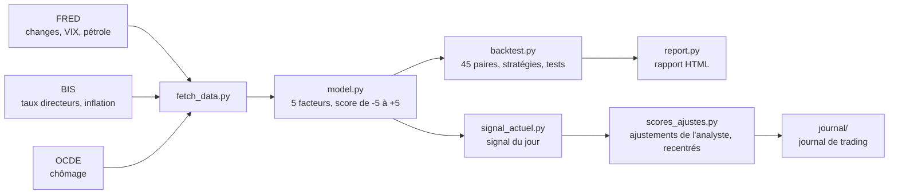

# Backtest Forex G10 : force relative fondamentale


Une méthode de trading Forex est-elle rentable, ou seulement logique ?
Ce projet transforme une méthode d'analyse fondamentale en règles chiffrées,
puis la teste sur **26 ans de données (2000-2026)** et **45 paires de devises**,
sans utiliser d'information qui n'était pas encore publiée à la date de chaque décision.

---

## Le principe

On ne juge jamais une devise seule : on oppose la plus **forte** à la plus **faible**.
Chaque mois, les 10 devises du G10 (USD, EUR, GBP, JPY, CHF, AUD, NZD, CAD, NOK, SEK)
reçoivent un score de **-5 à +5** à partir de cinq facteurs :

| Facteur | Poids | Mesure utilisée |
|---|---|---|
| Politique monétaire | 30 % | Variation des taux directeurs sur 3 et 12 mois |
| Croissance et emploi | 20 % | Baisse du chômage sur 6 mois |
| Inflation | 20 % | Écart à la cible et accélération sur 6 mois |
| Différentiel de taux | 15 % | Niveau du taux directeur |
| Risque et géopolitique | 15 % | Stress du VIX selon le profil refuge, choc pétrolier selon l'exposition |

Chaque facteur est normalisé entre devises (z-score en coupe transversale) : un score est toujours **relatif** aux autres.

## Résultats

Décisions mensuelles de janvier 2000 à août 2026, nettes de coûts de transaction, portage inclus.

| Stratégie | Mois gagnants | Sharpe | Drawdown max | Sharpe 2013-2026 |
|---|---|---|---|---|
| Panier 3 devises fortes contre 3 faibles | 56,9 % | 0,36 | -14 % | 0,11 |
| Paire la plus forte contre la plus faible | 54,7 % | 0,28 | -24 % | 0,05 |
| Repère : portage pur (taux seuls) | 60,0 % | 0,41 | -35 % | 0,28 |

**Ce que montrent les tests :**

- **Le signal n'est pas dû au hasard.** Sur 500 classements de devises tirés au sort, seuls 1 % font aussi bien (p = 0,01).
- **L'écart de score compte.** Toutes paires confondues, le taux de réussite passe de 50,6 % quand l'écart est inférieur à 1 point à 55,7 % au-delà de 5 points.
- **L'emploi est le meilleur facteur.** Seul, il atteint un Sharpe de 0,57, stable avant et après 2013. Les décisions de taux, déjà anticipées par le marché, n'apportent presque rien seules.
- **La méthode protège mieux que le portage.** En 2008, elle perd beaucoup moins, avec un drawdown de -14 % contre -35 %.
- **L'avantage s'est nettement réduit depuis 2013.** C'est un filtre utile pour choisir ses paires, pas une stratégie autonome.

Le rapport complet est dans `results/rapport_backtest.html` : courbes de capital, détail des 45 paires, résultats par régime de marché et par année.

## Méthodologie et garde-fous

- **Pas de biais d'anticipation.** Chaque donnée macro est décalée de son délai réel de publication : 1 mois pour l'inflation, 3 mois pour les séries trimestrielles, 2 à 3 mois pour le chômage.
- **Coûts réalistes.** De 1,5 à 6 points de base par transaction selon la liquidité de la paire, plus le portage au différentiel de taux.
- **Aucun paramètre optimisé après coup.** Les pondérations sont fixées avant de lancer le test.
- **Tests de robustesse :**
  - permutation aléatoire ;
  - signal retardé d'un mois ;
  - horizon de 3 mois ;
  - découpage en deux sous-périodes ;
  - pondération adaptative calculée uniquement sur le passé (walk-forward).

## Architecture



```
├── fetch_data.py        téléchargement des données publiques (sans clé API)
├── model.py             facteurs et scores des devises
├── backtest.py          moteur de backtest et tests de robustesse
├── report.py            génération du rapport HTML
├── signal_actuel.py     signal du modèle à la dernière date disponible
├── scores_ajustes.py    ajustements qualitatifs, recentrés pour rester relatifs
├── taux_manuels.json    décisions de taux récentes pas encore publiées par la BIS
├── results/             résultats du backtest (CSV, JSON, rapport)
├── journal/             journal de trading local (HTML/JS)
└── claude/skills/forex  commande Claude Code /forex (analyse hebdomadaire)
```

## Installation

```bash
git clone https://github.com/Jojobcd/forex-backtest.git
cd forex-backtest
python -m venv .venv
.venv/Scripts/python -m pip install -r requirements.txt   # Linux/macOS : .venv/bin/python
.venv/Scripts/python fetch_data.py
```

## Utilisation

```bash
python signal_actuel.py   # classement des devises aujourd'hui (quelques secondes)
python backtest.py        # backtest complet (environ 5 minutes)
python report.py          # rapport HTML dans results/
```

La date de fin du backtest se cale toute seule sur le dernier mois complet.

## Journal de trading

`journal/Journal Forex.html` s'ouvre dans un navigateur, sans serveur.
Il est conçu pour être lisible par quelqu'un qui ne trade pas :

- chaque idée est expliquée en une phrase simple ;
- une « météo des devises » montre le classement du plus fragile au plus solide ;
- le bilan est exprimé en mises risquées (R), indépendamment de la taille du compte ;
- un tableau compare les trades qui suivent le classement à ceux qui vont contre.

Les trades restent dans le navigateur. Un export et un import JSON permettent de les sauvegarder.

## Limites

- **Données révisées.** Les séries macro sont les versions actuelles, pas celles publiées à l'époque. Les révisions de l'inflation et du chômage sont faibles, mais existent.
- **Ce qui n'est pas modélisé :**
  - le ton des communiqués et discours des banques centrales ;
  - les anticipations de marché (OIS, FedWatch) ;
  - le positionnement (rapport COT) ;
  - les surprises par rapport au consensus.
- **Portage approché.** Il est calculé au taux directeur, sans swap ni frais de courtier.

## Feuille de route

- [x] Modèle de scores et backtest 2000-2026 sur 45 paires
- [x] Rapport HTML et journal de trading
- [x] Contrôles contre les scores faussés par une donnée manquante
- [ ] Score NLP du ton des banques centrales (communiqués et procès-verbaux)
- [ ] Indice d'incertitude politique par pays
- [ ] Bilan de 3 mois de suivi en conditions réelles

## Ce que j'ai appris

- Le piège principal d'un backtest est d'utiliser, sans le voir, une information qui n'existait pas encore à la date de la décision.
- Un bon résultat global peut cacher une performance qui s'effondre sur la période récente : il faut toujours découper.
- Une seule donnée manquante peut fausser tout un classement relatif. Le pipeline vérifie désormais les taux les plus récents avant chaque analyse.

## Avertissement

Projet d'étude personnel. **Ce n'est pas un conseil financier.**
Les performances passées ne préjugent pas des performances futures.
Le trading de devises comporte un risque de perte en capital.

## Auteur

**N'Dri Jaurès** · Développeur full stack, Master 2 Big Data et IA
GitHub : [@Jojobcd](https://github.com/Jojobcd)
